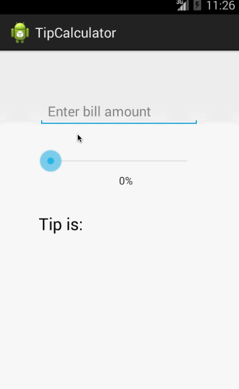

This is an Android demo application for Tip Calculator

Time spent: 3.5 hours spent in total

Completed user stories:

Required: User is displayed the tip of specified percentage for specified entered amount
Required: User enters the total amount of the transaction
Required: User can select between tip amounts (i.e 10%, 15%, 20%)
Upon selecting tip amount, formatted tip value is displayed
(Optional) User changes the total amount and updated tip is reflected automatically
(Optional) User can select custom tip percentage if desired

